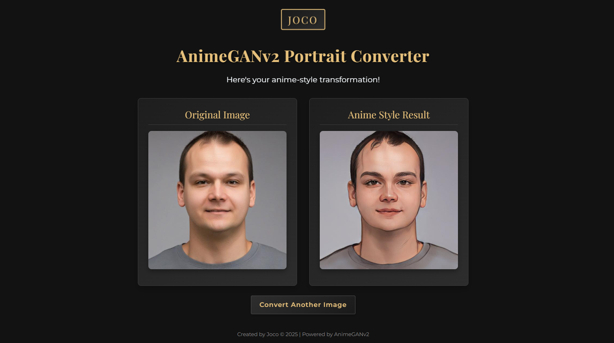

# ModelRunnerPro

<div align="center">
  
</div>

A Flask-based web application for running and managing AI models, specifically focused on image processing and model inference.

## Features

- Flask web application with Gradio integration
- Support for multiple AI models
- Image processing capabilities
- Environment variable configuration
- Secure API key management
- Docker support for easy deployment

## Prerequisites

- Python 3.11 or higher
- pip (Python package installer)
- Virtual environment (recommended)
- Docker (optional, for containerized deployment)

## Installation

### Option 1: Local Installation

1. Clone the repository:
```bash
git clone <repository-url>
cd ModelRunnerPro
```

2. Create and activate a virtual environment:
```bash
# Create virtual environment
python -m venv venv

# Activate virtual environment
# On Windows:
venv\Scripts\activate
# On Unix/MacOS:
source venv/bin/activate
```

3. Install dependencies:
```bash
pip install -r requirements.txt
```

4. Create a `.env` file in the project root:
```env
HUGGINGFACE_TOKEN=your_huggingface_token_here
```

### Option 2: Docker Installation

1. Clone the repository:
```bash
git clone <repository-url>
cd ModelRunnerPro
```

2. Create a `.env` file in the project root:
```env
HUGGINGFACE_TOKEN=your_huggingface_token_here
```

3. Build the Docker image:
```bash
docker build -t modelrunnerpro .
```

## Running the Application

### Option 1: Local Run

1. Make sure your virtual environment is activated

2. Start the Flask application:
```bash
python main_flask.py
```

3. Access the application:
- Web interface: http://localhost:5000
- API endpoints: http://localhost:5000/api/...

### Option 2: Docker Run

1. Run the Docker container:
```bash
docker run -d \
  --name modelrunnerpro \
  -p 5000:5000 \
  --env-file .env \
  modelrunnerpro
```

2. Access the application:
- Web interface: http://localhost:5000
- API endpoints: http://localhost:5000/api/...

## Project Structure

```
.
├── .env                    # Environment variables (create this)
├── .gitignore             # Git ignore file
├── .dockerignore          # Docker ignore file
├── Dockerfile             # Docker configuration
├── main_flask.py          # Main Flask application
├── requirements.txt       # Project dependencies
└── venv/                  # Virtual environment directory
```

## Dependencies

- Flask >= 3.1.1
- Flask-SQLAlchemy >= 3.1.1
- Gradio >= 5.29.1
- Gunicorn >= 23.0.0
- Pillow >= 11.2.1
- PyTorch >= 2.7.0
- TorchVision >= 0.22.0
- python-dotenv >= 1.0.0
- email-validator >= 2.2.0
- psycopg2-binary >= 2.9.10

## Environment Variables

The following environment variables are required:

- `HUGGINGFACE_TOKEN`: Your Hugging Face API token for model access

## Contributing

1. Fork the repository
2. Create a feature branch
3. Commit your changes
4. Push to the branch
5. Create a Pull Request

## License

This project is licensed under the MIT License - see the LICENSE file for details.

## Support

For support, please open an issue in the GitHub repository or contact the maintainers. 